# IBM Digital Business Automation Exercise
## How to build a bot using WDG RPA (Robotic Process Automation)

### Introduction
July 8th, 2020 IBM announced that it will be acquiring WDG Automation to strengthen IBM DBA portfolio (https://newsroom.ibm.com/2020-07-08-IBM-to-Acquire-WDG-Automation-to-Advance-AI-Infused-Automation-Capabilities-for-Enterprises). IBM has been in strategic co-operation with Automation Anywhere (AA), providing IBM RPA with Automation Anywhere RPA solution based on Automation Anywhere RPA platform. Although the co-operation with AA will continue, WDG Automation technology will join the IBM Cloud Integration organization and be available through IBM Cloud Pak for Automation on-premises, and in public or private cloud environments.

This exercise is a copy of current "Build a Bot Tutorial" available in IBM Demos (https://www.ibm.com/cloud/garage/dte/tutorial/build-bot-tutorial) that was originally built for IBM RPA with Auttomation Anywhere.

### Use case
In this exercise you will build a robot to automate processing sales leads that arrive in a CSV/Excel format. Each row of the file represents a separate sales lead. The sales leads need to be manually entered (copy/paste) by an analyst into the online opportunity system of record (JK Automation Sales Leads). This task is error prone and the analysts repeatedly ask if this can be automated, but it has never been a company priority. Until now 😉

### Prerequisites
- Personal WDG Automation Account activated
- WDG Studio installed and configured to your computer

### Exercise instructions
**(1) Start WDG Automation Studio**
- Double-click the `WDG Studio shortcut` in your desktop.

  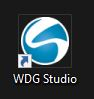

- When the login window opens (might take a while for the first time), type in your username and hit the `Login button`.

  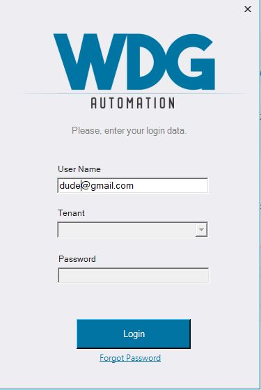

- When your tenant name is displayed, type in your password and hit the `Login button` again.

<!-- 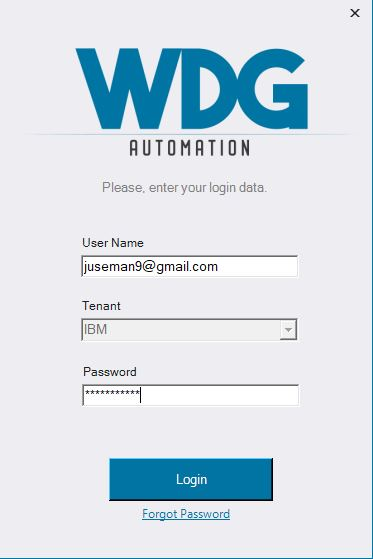 -->

**(2) Create a new WAL file by clicking the `New` icon from the top toolbar or `New` under "Get Started" section**

  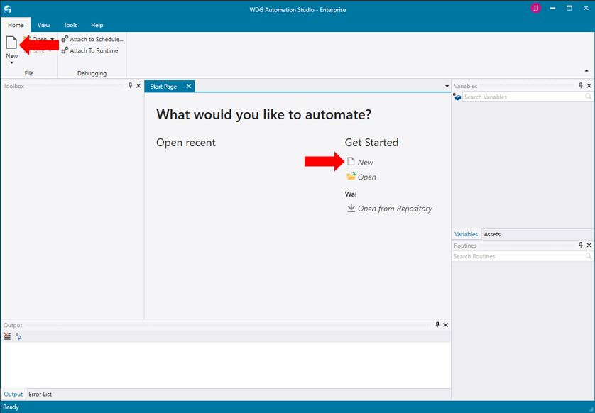

- Select `WAL file` (WDG Automation Language) and click `Open`.

  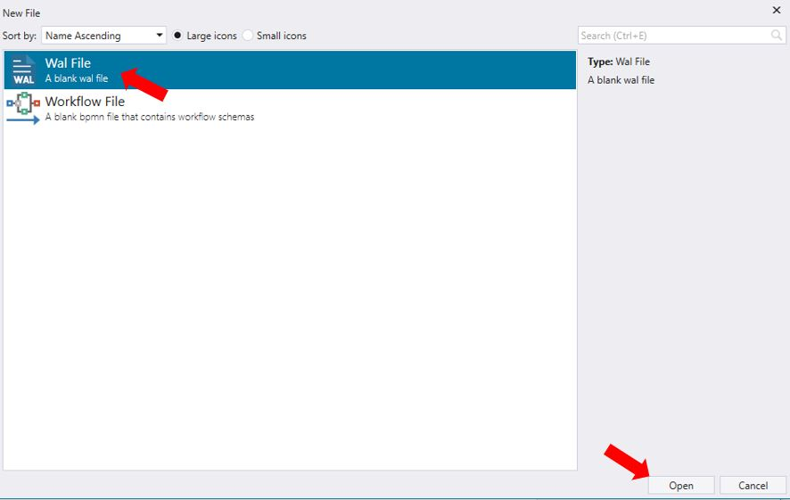

**(3) Create your bot script - Login to JK Automation website**

You should now have your Studio opened with a empty WAL file in your Designer view. Note that you change your view between Script, Designer and Call Graph.

  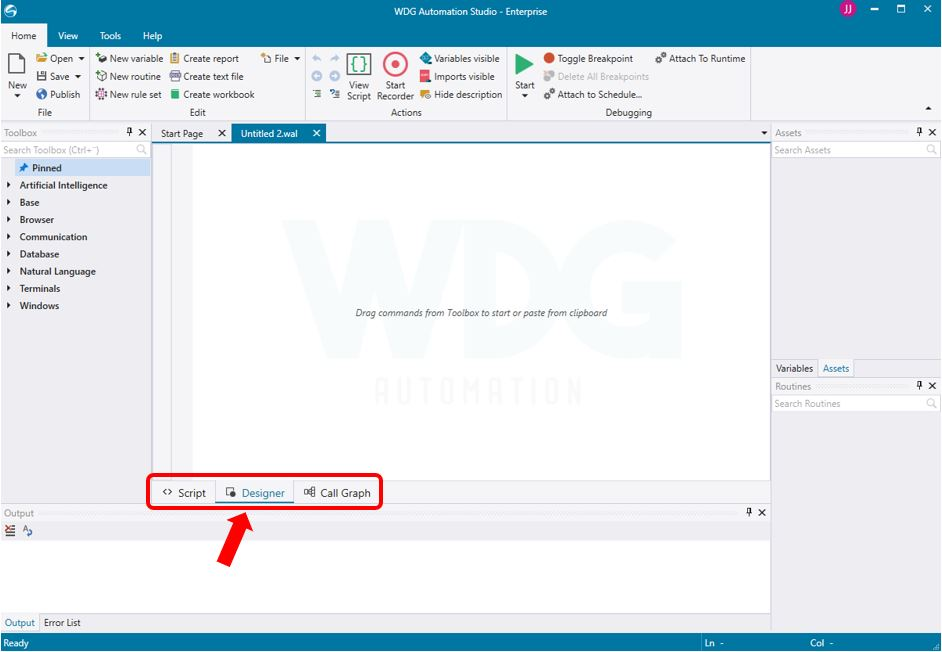

- Add `Start Browser` command from your Toolbox to your Designer view. You can find the command under Browser --> Actions. Drag and drop it to your canvas.

  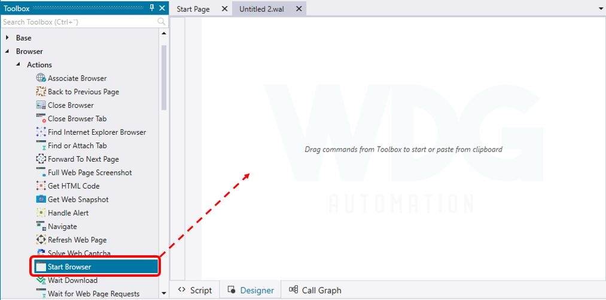

- The command configuration opens. You need to set name to your browser instance (for example `web01`). Keep `Google Chrome` selected as your browser type, if you have Chrome installed. You can also change the browser to one you want to use. Click `Save` button.

  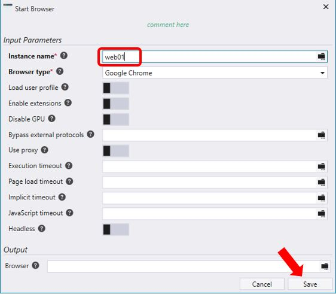

- `Close Browser` configuration window pops up automatically. Make sure to set the same instance name value that you used for `Start Browser`. Also set `Keep browser open` as enabled. This helps you during the implementation so that browser is not closed when you test your automation and you can continue using it for defining next actions for your automation. Click `Save` button to close the configuration window.

  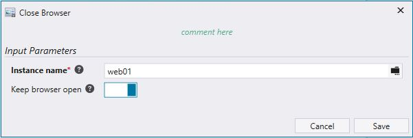

- Next command we want to is `Navigate`. You can find it also under Browser --> Actions. Drag and drop it below the `Start Browser` command to your Designer view. Set the URL to `http://jk-automation.mybluemix.net` and click the `Save` button.

  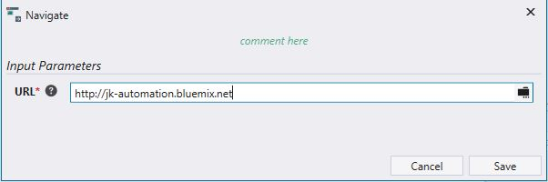

- Save your work by hitting `Ctrl+S` or the `Save icon` from the top toolbar. Name your automation WAL file to `jk-automation.wal`. Your automation should now look as follows.

  

- Run your automation to test that it works and JK Automation website is opened. Click the small arrow below green `Run` icon form the top toolbar and select `Run without debugging`. Alternatively you can hit `Ctrl+F5`.

  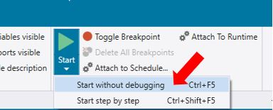

- You should see new Chrome Browser window opened and JK Automation login page opened. Note! For the first time this might take a couple of seconds. When you go back to your Studio window, you should see `Execution succeeded` text at the bottom left-hand side corner. _**Make sure to leave the browser window open!**_

  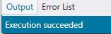

- Nice! Your first run with WDG Automation 👍🏻Let's keep on going! Next we will need to automate the login to JK Automation website.

> Currently WDG does not offer similar mechanism as in AA (object cloning) to automate capturing object (like web form fields) details that you want to use in your automation. For web pages this needs to be done manually using browser functionality to inspect the object and copy the selector for it. WDG support several selectors: id, name, css, xpath, id + name.

- Open JK Automation browser window that you should have open. Right-click the `Username` field and from the opened menu select `Inspect`.

  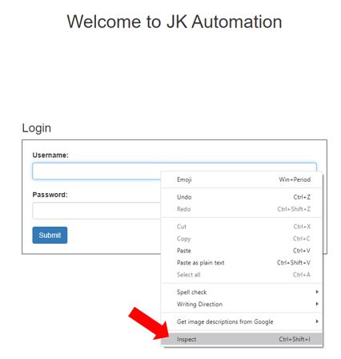

- This open your browsers element inspector with the Username field element selected. Right-click the selected element, select `Copy` --> `Copy selector`. This will copy the CSS selector for the element to your clipboard.

  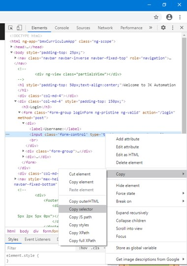

- Go back to your WDG Studio and add `Set Value to Field` (Browser --> Fields) command to your automation just under `Navigation` command. When the command configuration window opens set _Value_ to "**whatever**" (username you use does not matter), _Selector Type_ to **Css** and _Css_ to **the value from your clipboard** (the selector you copied from element inspector). Finally click `Save`.

  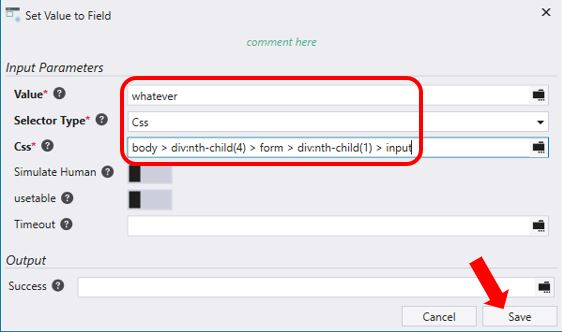

- Similarly add new `Set Value to Field` command below the previous for the `Password` field. Set _Value_ to **password10**.

  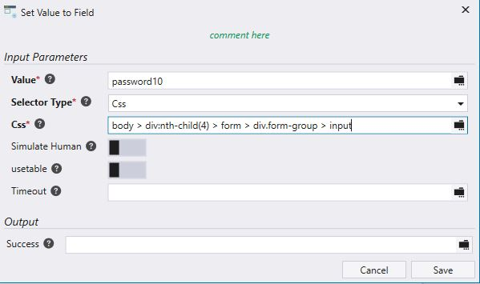

- Now, let's finish the login sequence by adding a command to click the `Submit` button in the JK Automation login page. We'll do that by adding command `Click on Web Page` after the Set Value to Field commands

> Note that you can use toolbox search field to find commands. To display all the commands related to clicking, type **click** to the search field.

  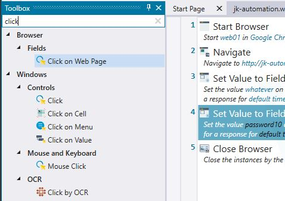

-  Get the selector for the button from your browsers element inspector as earlier did for the Username and Password fields.

  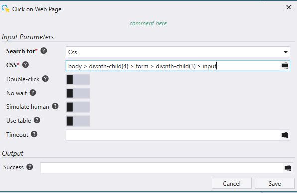

- Your automation should look like as follows. Nice, good job!

  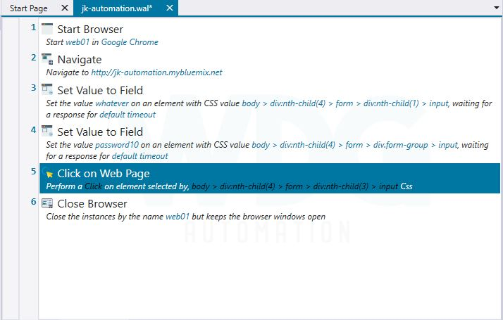

**(4) Test your automation and continue implementation - Read CSV**

`Save your work`, `close your browser with JK Automation login page` and `run your current automation as you did earlier (Start without debugging)`. You should see your bot executing, opening the JK Automation web page and logging in with the information that you used to develop the login sequence. When your bot is finished, you should see the JK Automation welcome page.

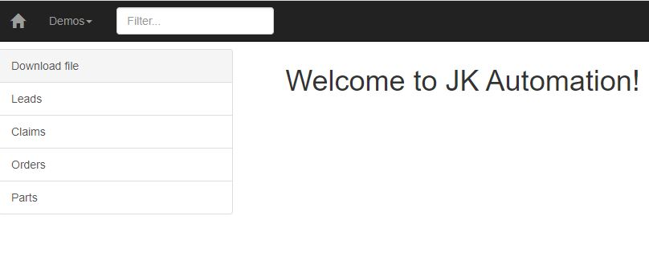

- Since we want to handle _Leads_, add a `Click on Web Page` command to your automation to click the `Leads` link in the left-hand side menu. Yet again, use your browsers element inspector to get the needed selector for the Leads link.

  

- Click the `Download file` link in the left-hand side menu to download the CSV-file that we will use to read some new sales leads from and add them to JK Automation system. _**Save the file to your computer and take note of the folder you saved it to**_. You will need that later on.

- When you have downloaded the CSV-file, click the `Leads` link to open the JK Automation Sales Leads view in your browser.

  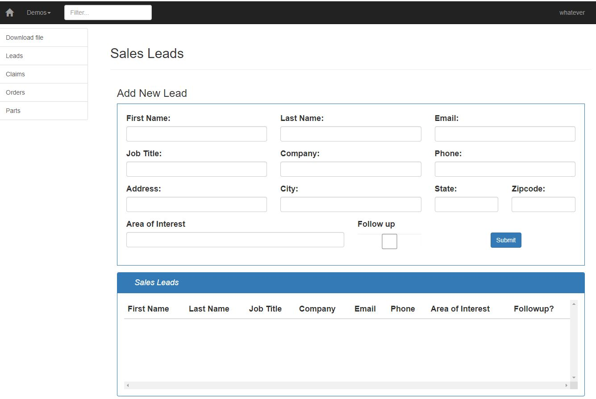

- Good. We can now read the CSV-file. Use toolbox search to find `Read CSV File` command and add it after your last Click on Web Page command.

- When the command configuration window opens, use the `folder browse icon` to select the file you just downloaded from your file system, leave all the other selections as they are in default. There are three outputs for the command: _Data Table_ (holds the data), _Rows_ (number of rows in the data table) and _Columns_ (number of columns in the data table). We want to store these to variables.

  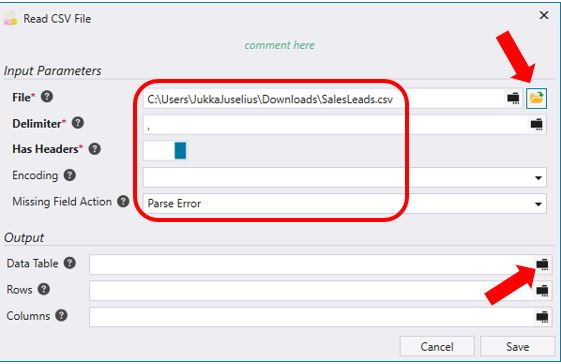

- First, **Click** the folder icon besides the Data Table field to open variable list (as shown in picture above). Next, click `Add new variable` icon and the `Define Variable` window opens.

  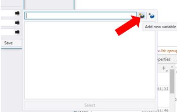

- Name the variable as **leads**. Notice that the variable type is automatically set to match the output type (Data Table). Click `Save`.

  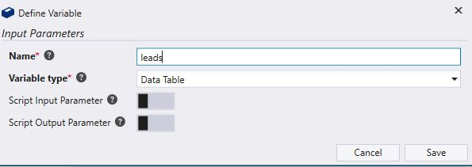

- Repeat the previous steps to create variables also for other outputs _Rows_ and _Columns_. Name them **row_count** and **column_count**, respectively. Your `Read CSV File` command configuration should now look as follows. Click `Save`.

  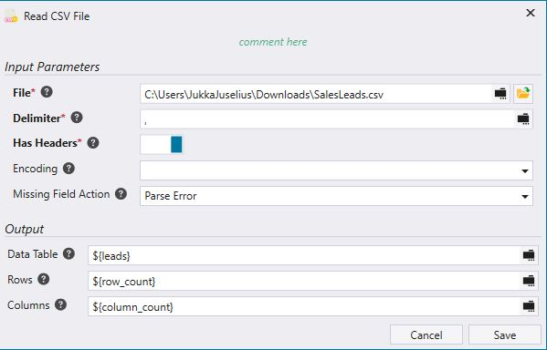

- Now, we obviously want to iterate through all the rows within the data table and insert the data to JK Automation Sales Leads page. Let's focus first on getting a lead read from the data table. There's an quite handy command named `Map Table Row` to do this. Use your toolbox search to find the command and drag and drop it under
the `Read CSV File` command in your Designer view.

- When the configuration window opens, select variable **leads** to `Data Table` and then create a new variable for `Row` called **row_iterator** (since we want a variable to iterate through the data table) and set the default value for it to **1**.

  

- Next we need to create mappings for the data table row. If you open the CVS file that we're using for the lab with Excel / Notepad, you can see that there's 12 data rows and also 12 different columns: **First Name**, **Last Name**, **Job Tile**, **Company**, **email**, **phone**, **Client Address**, **Client City**, **Client State**, **Client Zipcode**, **Area of Interest** and **Followup Requested**.

  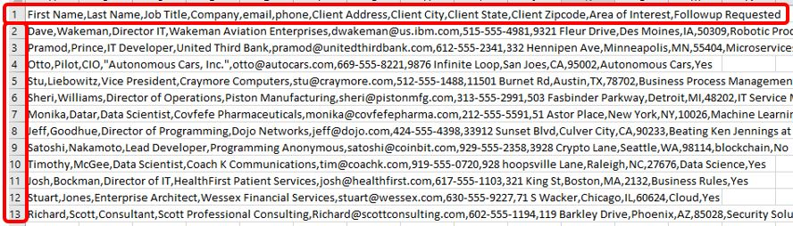

- Click `plus sign (+)` within your `Map Table Row` configuration window to add all the needed mappings for your row. Use the `Column Name` to identify the data for the mapping and create a new variable to hold the data. Map and and name the variables as follows.

  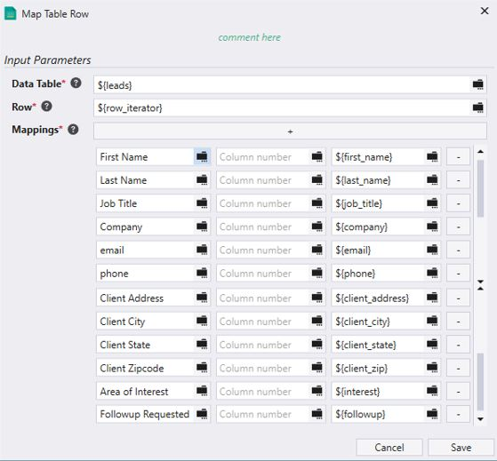

- Good. Click `Save` to save and close the configuration. Now we need to insert the data to JK Automation Sales Leads page that you should still have open in your browser.

> If you have closed JK Automation web page, you can always run your current automation to get the JK Automation Sales Leads page opened and continue from there.

- As you already earlier did (when creating the login sequence), use consecutive `Set Value to Field` commands to insert data that we just extracted to JK Automation Sales Leads page and to it's matching fields. Let's go through the first mapping together.

  - Right-click the `First Name` input field in the web page, select `Inspect` --> `Copy` --> `Copy Selector`

  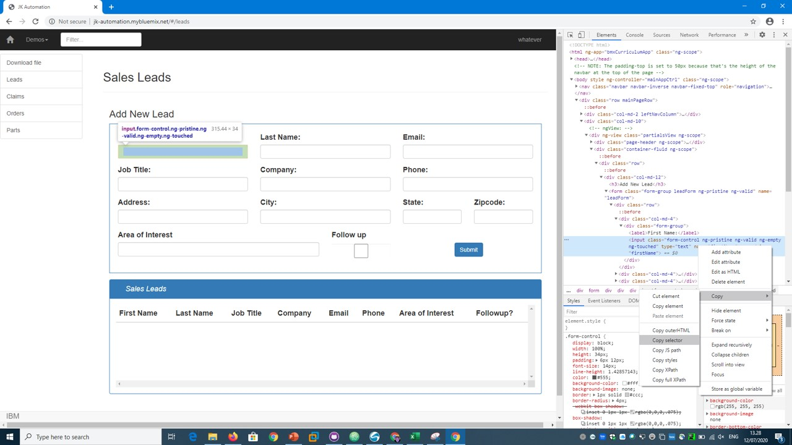

  - Add `Set Value to Field` command to your automation under `Map Table Row` command and configure using it your just copied selector and the extracted variable **first_name**. **_NOTE!_** Enable also `Simulate Human` option. Click `Save`.

  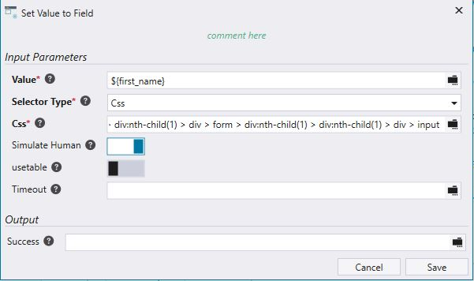

- Similarly, set all the input fields till `Are of Interest` and when you have 11 consecutive `Set Value to Field` commands in your automation.

> Note. You can use copy-paste in your Designer view to easily copy commands.

- Next, add `If` command (Under _Base_ --> _Flow Control_) to your automatio under the last `Set Value to Field` command. Configure it using the **followup** variable as follows.

  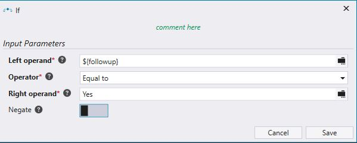

- Add `Click on Web Page` command between _If_ and _End If_. Configure it with using the selector for the **_Follow up_ check box** in the Sales Leads web page.

  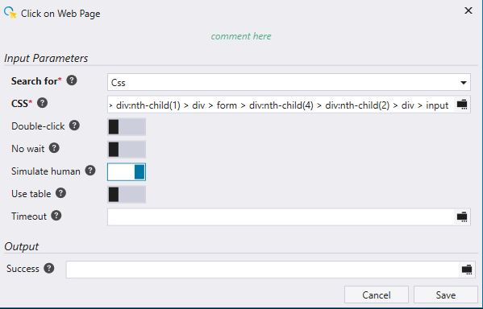

- Finally, add `Click on Web Page` command under _End If_ to click the **Submit** button in the Sales Leads web page

- **Save** your work, **close your browser** showing the JK Automation web site and **run** your automation by hitting the `Run` icon in the top toolbar. You should see your automation executing and entering the first sales lead (Dave Wakeman) to the JK Automation Sales Leads page. Nice!

  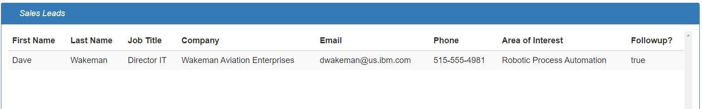

---
_Author: Jukka Juselius (jukka.juselius@fi.ibm.com)_
